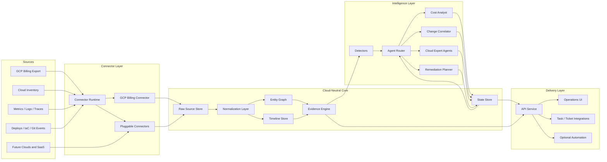

# FinSRE

FinSRE is a planning-stage tool for cloud cost optimization and cost incident investigation. The long-term goal is to connect billing, observability, infrastructure, deployment, and operational data, then use specialized agents to recommend real cost-saving work and explain abnormal cost changes with evidence.

The first target cloud is Google Cloud Platform. The architecture should stay cloud-neutral enough that AWS, Azure, Kubernetes, SaaS spend, and custom internal platforms can be added later through connectors and normalized data models.

## Core Idea

FinSRE has two main loops:

1. Cost optimization: find concrete, reviewable tasks that reduce spend without creating unacceptable reliability, security, or delivery risk.
2. Cost abnormality investigation: detect unusual cost movement, correlate it with changes, and produce a ranked explanation of likely causes.

The tool should not only say "cost went up." It should answer:

- What changed?
- When did it start?
- Which service, team, workload, project, namespace, region, SKU, or deployment is responsible?
- What evidence supports the hypothesis?
- What action should a human or automation take next?
- How confident are we, given the data available?

## Data Sources

FinSRE should support multiple hooks and connectors. Different organizations will expose different levels of data, so recommendations and investigations must degrade gracefully.

### Initial GCP Sources

- Cloud Billing export to BigQuery
- Cloud Asset Inventory
- Cloud Monitoring metrics
- Cloud Logging
- Cloud Trace, where available
- GKE and Kubernetes resource data
- IAM, projects, folders, labels, and organization hierarchy
- Deployment events from Cloud Deploy, GitHub Actions, GitLab, Argo CD, Flux, Terraform, or CI/CD webhooks
- Infrastructure state from Terraform, Pulumi, Config Connector, or direct cloud inventory

### Future Sources

- AWS Cost and Usage Reports
- Azure Cost Management exports
- OpenTelemetry metrics, logs, and traces
- OpenCost or Kubecost-style Kubernetes allocation data
- Incident systems such as PagerDuty or Opsgenie
- Ticketing systems such as Jira, Linear, GitHub Issues, or ServiceNow
- Source control metadata from GitHub, GitLab, or Bitbucket
- Data warehouse and BI usage
- SaaS billing exports
- Community or open ecosystem knowledge sources, if licensing and quality are acceptable

## Data Access Levels

The product should explicitly model how much data is available. This avoids pretending to have certainty when only billing data exists.

| Level | Available Data | What FinSRE Can Do |
| --- | --- | --- |
| 0 | Manual import or static billing reports | Basic summaries and high-level savings ideas |
| 1 | Billing export | Cost trends, SKU analysis, project/service attribution |
| 2 | Billing plus cloud inventory | Better ownership, unused resources, rightsizing candidates |
| 3 | Billing plus monitoring | Utilization-aware optimization and anomaly context |
| 4 | Billing plus logs/traces/deployments | Change correlation and stronger root-cause hypotheses |
| 5 | Full operational context plus feedback loop | Continuous tracking, learning from accepted/rejected recommendations |

Higher levels make the tool stickier because FinSRE becomes part of the operational feedback loop, not only a reporting layer.

## System Architecture

The system should be built around normalized events, bounded context, and specialized agents.



```text
Connectors
  -> Raw data lake / warehouse
  -> Normalization and enrichment
  -> Cost, resource, metric, log, trace, and change event models
  -> Timeline and state store
  -> Detectors and expert agents
  -> Router / orchestrator
  -> Recommendations, investigations, tasks, and feedback
```

### Core Services

- Connector runtime: schedules pulls, handles webhooks, tracks sync state, and records source freshness.
- Normalization layer: maps cloud-specific data into common models.
- Entity graph: links cost, resources, workloads, teams, deployments, services, repositories, and incidents.
- Timeline store: records changes and observations in time order so abnormality analysis can correlate events.
- State store: tracks investigations, hypotheses, recommendation lifecycle, accepted actions, rejected actions, and outcomes.
- Agent router: selects the right expert agent or workflow based on the question, available data, and current investigation state.
- Evidence engine: attaches data-backed evidence to every recommendation and root-cause hypothesis.
- Task manager: turns findings into actionable work items with owners, impact, risk, and status.

## First Implementation Slice

The first code shard is intentionally narrow:

- Abstract connector interfaces and normalized cost models.
- A GCP Billing Export connector that builds a daily cost query for BigQuery.
- A small API surface to inspect registered connectors and preview the billing query.
- Deployment assets for local containers, Cloud Run-style containers, and Helm-based Kubernetes installs.

This first slice does not require an in-cluster agent. It assumes FinSRE runs as a service and receives cloud access through workload identity, service account credentials, or an equivalent cloud-native identity. A lightweight in-cloud collector can be added later if organizations want data collection to stay inside their own boundary.

## Agent Model

FinSRE should use multiple expert agents, but the agents should operate on curated context rather than huge raw prompts.

### Candidate Agents

- Cost analyst: explains cost movement across projects, services, SKUs, regions, teams, and time windows.
- Anomaly detector: finds abnormal spend patterns and classifies severity.
- Change correlator: matches cost changes with deploys, config edits, infrastructure changes, incidents, and traffic changes.
- GCP expert: understands GCP-specific services, billing SKUs, quotas, labels, projects, and common cost traps.
- Kubernetes expert: analyzes cluster, namespace, workload, node pool, request, limit, and allocation data.
- Rightsizing expert: recommends resource resizing from utilization and performance data.
- Commitment expert: analyzes committed use discounts, reservations, savings plans, and sustained-use behavior.
- Logging and observability expert: finds log, metric, trace, and retention cost opportunities.
- Data quality expert: detects missing labels, broken exports, stale connectors, and weak attribution.
- Remediation planner: converts validated findings into safe, reviewable tasks.

### Router Requirements

The router should:

- Keep prompts small by retrieving only relevant facts, summaries, and timeline slices.
- Track investigation state outside the LLM.
- Route by task type, cloud, service, data availability, confidence, and risk.
- Support deterministic workflows for common cases.
- Support LLM reasoning where ambiguity, explanation, or planning is useful.
- Record which agent produced each hypothesis, with evidence and confidence.
- Avoid one giant context window as the primary architecture.

LangGraph is a candidate for workflow orchestration because the problem naturally involves stateful routing, multi-step investigations, and agent handoffs. It should be validated against simpler alternatives before becoming a hard dependency.

## Normalized Data Model

The first implementation should define a small durable model before adding many connectors.

### Entities

- Organization
- Cloud account, project, subscription, or tenant
- Service
- Resource
- Workload
- Team or owner
- Repository
- Deployment
- Incident
- Cost line item
- Metric series
- Log-derived signal
- Trace-derived signal
- Recommendation
- Investigation
- Hypothesis
- Task

### Event Types

- Cost observed
- Resource created, updated, deleted
- Deployment completed or rolled back
- Configuration changed
- Traffic changed
- Utilization changed
- Error rate changed
- Alert fired or resolved
- Incident opened or closed
- Recommendation created, accepted, rejected, completed, or expired

## Recommendation Lifecycle

Every recommendation should move through a clear lifecycle:

1. Detected
2. Enriched with evidence
3. Risk scored
4. Deduplicated against existing work
5. Assigned or routed
6. Accepted, rejected, deferred, or automated
7. Verified after change
8. Learned from outcome

Recommended fields:

- Title
- Summary
- Estimated monthly savings
- Confidence
- Risk
- Blast radius
- Evidence
- Affected entities
- Suggested owner
- Suggested action
- Rollback or safety note
- Verification query
- Status

## Abnormality Investigation Flow

1. Detect abnormal cost movement.
2. Scope the anomaly by time, service, SKU, project, region, workload, and owner.
3. Pull related changes from the timeline.
4. Ask specialist agents to generate hypotheses.
5. Rank hypotheses by evidence, time proximity, known behavior, and magnitude.
6. Produce an investigation summary with confidence and next steps.
7. Track resolution and whether the hypothesis was correct.

Example output:

```text
Anomaly: BigQuery cost increased by 38 percent from 2026-05-10 to 2026-05-12.

Likely cause:
  A scheduled query in project analytics-prod changed from partition-filtered scans
  to full-table scans after commit abc123.

Evidence:
  - SKU increase is concentrated in BigQuery analysis bytes.
  - Query job bytes processed increased 4.2x after the deployment.
  - Change timestamp is 17 minutes before the cost inflection.

Suggested action:
  Review query report_daily_revenue and restore partition predicate.
```

## GCP-First MVP

The first milestone should prove the product loop with a narrow but real path.

### MVP Scope

- Ingest GCP Billing export from BigQuery.
- Ingest basic GCP project and resource inventory.
- Build normalized cost line items and resource entities.
- Show cost trends by project, service, SKU, region, and labels.
- Detect simple anomalies using historical baselines.
- Accept deployment or change events through a webhook.
- Correlate cost anomalies with nearby changes.
- Generate evidence-backed recommendations.
- Track recommendation and investigation state.

### MVP Non-Goals

- Full multi-cloud support
- Fully automated remediation
- Perfect attribution for unlabeled resources
- General-purpose chat over all logs and traces
- Replacing existing BI, observability, or incident tools

## Candidate Technical Direction

This is not final, but it gives the project a starting shape.

- Backend: Python service layer
- Workflow orchestration: LangGraph or a lightweight internal state machine
- Data warehouse: BigQuery first, with an abstraction for other warehouses later
- Operational store: PostgreSQL for entities, tasks, state, and metadata
- Search/retrieval: Postgres full text, vector search, or external search depending on scale
- Frontend: focused operations UI for investigations, recommendations, and timelines
- Connectors: modular adapter interface with source freshness and schema versioning
- LLM layer: provider-agnostic interface with structured outputs and strict evidence references

## Running the First Shard

The current implementation is a small API service with one concrete connector: `gcp-billing`.

### Local Development

```bash
python3 -m venv .venv
source .venv/bin/activate
pip install -e ".[gcp,dev]"
export FINSRE_GCP_BILLING_TABLE="billing-project.billing_dataset.gcp_billing_export_v1_XXXXXX"
export FINSRE_GCP_BILLING_PROJECT="billing-project"
uvicorn finsre.app:create_app --factory --reload
```

Useful endpoints:

- `GET /healthz`
- `GET /v1/connectors`
- `GET /v1/connectors/gcp-billing/query-preview`

### Container

```bash
docker build -t finsre:local .
docker run --rm -p 8080:8080 \
  -e FINSRE_GCP_BILLING_TABLE="billing-project.billing_dataset.gcp_billing_export_v1_XXXXXX" \
  -e FINSRE_GCP_BILLING_PROJECT="billing-project" \
  finsre:local
```

### Cloud Run

`deploy/cloudrun/service.yaml` is a starter Knative service manifest. The service should run with a service account that can read the configured BigQuery billing export table.

### Kubernetes / Helm

`deploy/helm/finsre` is a starter chart for running the service in Kubernetes.

```bash
helm upgrade --install finsre deploy/helm/finsre \
  --set image.repository=REPLACE_WITH_IMAGE \
  --set image.tag=REPLACE_WITH_TAG \
  --set env.FINSRE_GCP_BILLING_TABLE="billing-project.billing_dataset.gcp_billing_export_v1_XXXXXX" \
  --set env.FINSRE_GCP_BILLING_PROJECT="billing-project"
```

For GKE, prefer Workload Identity so the service does not need static credentials. For non-GCP clusters, use the platform's secret manager or workload identity equivalent.

## Design Principles

- Evidence first: every claim should point to data.
- Cloud-neutral core, cloud-specific expertise.
- Small context, strong state.
- Human review before risky action.
- Cost recommendations must include reliability and security risk.
- Prefer durable normalized models over prompt-only logic.
- Treat missing data as a first-class condition.
- Track outcomes so the system improves over time.

## Roadmap

### Phase 1: Planning and Model

- Define product requirements.
- Define normalized entity and event model.
- Define connector interface.
- Define recommendation and investigation schemas.
- Decide first backend stack.

### Phase 2: GCP Billing MVP

- Connect to GCP Billing export in BigQuery.
- Normalize cost data.
- Build project/service/SKU cost views.
- Add simple anomaly detection.
- Create initial recommendation records.

### Phase 3: Inventory and Ownership

- Ingest Cloud Asset Inventory.
- Link cost to resources where possible.
- Add labels, folders, projects, and owners.
- Add data quality recommendations.

### Phase 4: Change Correlation

- Add webhook-based deployment/change events.
- Build timeline view.
- Correlate anomalies with changes.
- Add hypothesis tracking.

### Phase 5: Expert Agents

- Add cost analyst, GCP expert, and change correlator agents.
- Add router and stateful investigation workflow.
- Add structured evidence output.
- Add feedback loop for accepted and rejected findings.

### Phase 6: Expansion

- Add Kubernetes allocation.
- Add monitoring utilization data.
- Add logging and observability cost recommendations.
- Add AWS or Azure connector.
- Add ticketing and incident integrations.

## Open Questions

- Who is the first target user: platform team, FinOps team, SRE team, engineering manager, or startup founder?
- Should the first UI be a dashboard, an investigation workspace, or a task inbox?
- What is the first high-value GCP cost domain: BigQuery, GKE, Compute Engine, Cloud Logging, Cloud Storage, or networking?
- Should the connector runtime be self-hosted, SaaS-hosted, or both?
- What data should be stored by FinSRE versus queried in-place?
- What privacy and security boundaries are required for logs, traces, and source control metadata?
- How much should the system automate versus only recommend?
- What is the minimum evidence standard before creating a task?
- Which community or open ecosystem projects are worth integrating with rather than rebuilding?

## Next Planning Steps

1. Pick the first user persona.
2. Pick the first GCP cost domain.
3. Choose the first data access level to support.
4. Define the MVP schemas.
5. Decide whether the initial product is CLI, API, or web UI.
6. Write one complete example investigation from data input to recommendation output.
