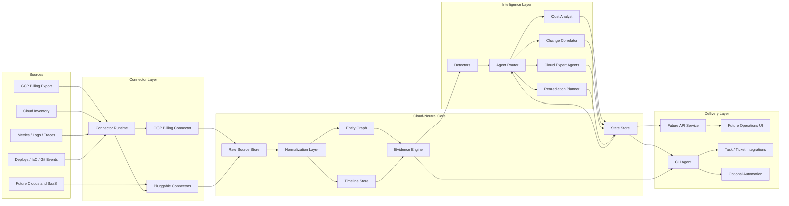

# FinSRE

FinSRE is a planning-stage tool for cloud cost optimization and cost incident investigation. The long-term goal is to connect billing, observability, infrastructure, deployment, and operational data, then use specialized agents to recommend real cost-saving work and explain abnormal cost changes with evidence.

The first target cloud is Google Cloud Platform. The architecture should stay cloud-neutral enough that AWS, Azure, Kubernetes, SaaS spend, and custom internal platforms can be added later through connectors and normalized data models.

## Core Idea

FinSRE has two main loops:

1. Cost optimization: find concrete, reviewable tasks that reduce spend without creating unacceptable reliability, security, or delivery risk.
2. Cost abnormality investigation: detect unusual cost movement, correlate it with changes, and produce a ranked explanation of likely causes.

The tool should not only say "cost went up." It should answer:

- What changed?
- When did it start?
- Which service, team, workload, project, namespace, region, SKU, or deployment is responsible?
- What evidence supports the hypothesis?
- What action should a human or automation take next?
- How confident are we, given the data available?
- Why we are not confident on some change or we don't know where they come from?(Point to lack of some metric, setup, etc, etc)

## Data Sources

FinSRE should support multiple hooks and connectors.
Different organizations will expose different levels of data, so recommendations and investigations must degrade gracefully.

### Initial GCP Sources

- Cloud Billing Account API for account and project billing relationships
- Cloud Billing Catalog API for services, SKUs, and pricing over a requested period
- Cloud Asset Inventory
- Cloud Monitoring metrics
- Cloud Logging
- Cloud Trace, where available
- GKE and Kubernetes resource data
- IAM, projects, folders, labels, and organization hierarchy
- Deployment events from Cloud Deploy, GitHub Actions, GitLab, Argo CD, Flux, Terraform, or CI/CD webhooks
- Infrastructure state from Terraform, Pulumi, Config Connector, or direct cloud inventory

### Future Sources

- AWS Cost and Usage Reports
- Azure Cost Management exports
- OpenTelemetry metrics, logs, and traces
- OpenCost or Kubecost-style Kubernetes allocation data
- Incident systems such as PagerDuty or Opsgenie
- Ticketing systems such as Jira, Linear, GitHub Issues, or ServiceNow
- Source control metadata from GitHub, GitLab, or Bitbucket
- Data warehouse and BI usage
- SaaS billing exports
- Community or open ecosystem knowledge sources, if licensing and quality are acceptable

## Data Access Levels

The product should explicitly model how much data is available. This avoids pretending to have certainty when only billing data exists.

| Level | Available Data | What FinSRE Can Do |
| --- | --- | --- |
| 0 | Manual import or static billing reports | Basic summaries and high-level savings ideas |
| 1 | Billing APIs and account metadata | Billing account discovery, project billing relationships, SKU and pricing context |
| 1.5 | Billing export or customer cost feed | Cost trends, SKU analysis, project/service attribution |
| 2 | Billing plus cloud inventory | Better ownership, unused resources, rightsizing candidates |
| 3 | Billing plus monitoring | Utilization-aware optimization and anomaly context |
| 4 | Billing plus logs/traces/deployments | Change correlation and stronger root-cause hypotheses |
| 5 | Full operational context plus feedback loop | Continuous tracking, learning from accepted/rejected recommendations |

Higher levels make the tool stickier because FinSRE becomes part of the operational feedback loop, not only a reporting layer.

## System Architecture

The system should be built around normalized events, bounded context, and specialized agents.



```text
Connectors
  -> Raw data lake / warehouse
  -> Normalization and enrichment
  -> Cost, resource, metric, log, trace, and change event models
  -> Timeline and state store
  -> Detectors and expert agents
  -> Router / orchestrator
  -> Recommendations, investigations, tasks, and feedback
```

### Core Services

- Connector runtime: schedules pulls, handles webhooks, tracks sync state, and records source freshness.
- Normalization layer: maps cloud-specific data into common models.
- Entity graph: links cost, resources, workloads, teams, deployments, services, repositories, and incidents.
- Timeline store: records changes and observations in time order so abnormality analysis can correlate events.
- State store: tracks investigations, hypotheses, recommendation lifecycle, accepted actions, rejected actions, and outcomes.
- Agent router: selects the right expert agent or workflow based on the question, available data, and current investigation state.
- Evidence engine: attaches data-backed evidence to every recommendation and root-cause hypothesis.
- Task manager: turns findings into actionable work items with owners, impact, risk, and status.

## First Implementation Slice

The first code shard is intentionally narrow:

- Abstract connector interfaces and normalized cost models.
- A GCP Cloud Billing API connector for account discovery, project billing relationships, service catalog, and SKU pricing over an explicit period.
- A small CLI surface to inspect registered connectors and preview the GCP API calls for a period.
- Deployment assets for local containers and scheduled/agent-style Cloud Run or Helm-based Kubernetes installs.

This first slice is a CLI agent. It can run locally, in CI, as a scheduled job, or as a containerized command in Cloud Run Jobs or Kubernetes CronJobs. It receives cloud access through workload identity, service account credentials, or an equivalent cloud-native identity. A long-running API service can be added later when the UI and state store need it.

Important limitation: the public Cloud Billing Account and Catalog APIs do not provide detailed historical usage-cost line items. They can tell us billing accounts, project billing associations, public services, SKUs, and pricing versions. Actual historical spend attribution will need a later source such as Billing Export, a customer-provided cost feed, or another cloud-native export.

### Python Module Layout

The MVP stays Python-first, but modules should stay separated by responsibility:

```text
src/finsre/
  cli.py              # Argument parsing and process exit behavior only
  cli_commands.py     # CLI command handlers
  config.py           # Environment/config loading
  core/               # Cloud-neutral events, ports, manifests, serialization
  connectors/         # Provider connectors and connector registry
  discovery/          # SKU classification, probe planning, context facts, questions
  agents/             # Agent contracts and router; LangGraph can plug in here
  memory/             # Memory/vector-store interfaces and early local stores
  tracker/            # Investigation and recommendation state tracking
```

Rules for new code:

- Put cloud/provider integration logic in `connectors`.
- Put SKU-to-probe routing and read-only context discovery in `discovery`.
- Put durable product concepts in `core` or `models`.
- Put agent orchestration behind `agents` so LangGraph remains replaceable.
- Put vector, retrieval, and long-term context code behind `memory`.
- Put investigation/recommendation lifecycle state behind `tracker`.
- Keep `cli.py` thin; it should parse arguments and delegate.

### Event-Driven Core

The core should be reusable enough for other projects, but not over-engineered. The current abstraction is deliberately small:

- `EventEnvelope`: a CloudEvents-inspired envelope for module-to-module messages.
- `ComponentManifest`: declares a component's name, kind, version, event inputs/outputs, dependencies, and deploy modes.
- `EventBus`: a port interface for publishing and subscribing to events.
- `InMemoryEventBus`: synchronous local implementation for tests and early CLI flows.

This lets the MVP run in-process while preserving a future split:

```text
single CLI process today
  connectors -> core events -> tracker / agents / memory

separate workers later
  connector job -> queue -> normalizer -> queue -> agent worker -> tracker service
```

Component boundaries can be inspected with:

```bash
finsre components list
```

Rules for keeping this light:

- Start every component in-process.
- Add a queue, service, or job boundary only when deployment or scaling requires it.
- Use events at boundaries, not inside every function call.
- Keep events as plain JSON-compatible data.
- Version event schemas when another component depends on them.

### SKU-Driven Discovery

Billing usage is the first routing signal. When a service/SKU has non-zero cost, FinSRE should classify that SKU and plan only the probes that can explain it.

```text
billed SKU observed
  -> classify SKU domain
  -> plan read-only probes
  -> collect context facts
  -> ask questions only for missing intent
  -> store facts/questions for future investigations
```

Current discovery modules:

- `billing-sku-discovery`: future source of observed SKU usage rows.
- `sku-classifier`: maps service/SKU descriptions into domains such as `network_egress`, `nat`, `load_balancer`, `bigquery`, `gke`, `logging`, `storage`, `compute`, and `sql`.
- `probe-planner`: maps domains to read-only probes.
- `asset-discovery`: placeholder for Cloud Asset Inventory, Resource Manager, and ownership discovery.
- `network-discovery`: placeholder for VPC, route, NAT, LB, VPN/Interconnect, and traffic-topology discovery.
- `telemetry-discovery`: placeholder for Monitoring, logs, and usage metric validation.
- `change-discovery`: placeholder for audit logs, deployments, and IaC changes.
- `context-fact-store`: stores discovered facts with source, confidence, evidence, and expiry.
- `question-planner`: asks humans only when missing intent blocks a recommendation.

Useful commands:

```bash
finsre discovery classify-sku \
  --service "Compute Engine" \
  --sku-id "egress-1" \
  --sku-description "Inter-region Egress" \
  --cost 42.50 \
  --project-id prod-api

finsre discovery plan-sku \
  --service "Compute Engine" \
  --sku-id "egress-1" \
  --sku-description "Inter-region Egress" \
  --cost 42.50 \
  --project-id prod-api
```

## Agent Model

FinSRE should use multiple expert agents, but the agents should operate on curated context rather than huge raw prompts.

### Candidate Agents

- Cost analyst: explains cost movement across projects, services, SKUs, regions, teams, and time windows.
- Anomaly detector: finds abnormal spend patterns and classifies severity.
- Change correlator: matches cost changes with deploys, config edits, infrastructure changes, incidents, and traffic changes.
- GCP expert: understands GCP-specific services, billing SKUs, quotas, labels, projects, and common cost traps.
- Kubernetes expert: analyzes cluster, namespace, workload, node pool, request, limit, and allocation data.
- Rightsizing expert: recommends resource resizing from utilization and performance data.
- Commitment expert: analyzes committed use discounts, reservations, savings plans, and sustained-use behavior.
- Logging and observability expert: finds log, metric, trace, and retention cost opportunities.
- Data quality expert: detects missing labels, broken exports, stale connectors, and weak attribution.
- Remediation planner: converts validated findings into safe, reviewable tasks.

### Router Requirements

The router should:

- Keep prompts small by retrieving only relevant facts, summaries, and timeline slices.
- Track investigation state outside the LLM.
- Route by task type, cloud, service, data availability, confidence, and risk.
- Support deterministic workflows for common cases.
- Support LLM reasoning where ambiguity, explanation, or planning is useful.
- Record which agent produced each hypothesis, with evidence and confidence.
- Avoid one giant context window as the primary architecture.

LangGraph is a candidate for workflow orchestration because the problem naturally involves stateful routing, multi-step investigations, and agent handoffs. It should be validated against simpler alternatives before becoming a hard dependency.

### LLM Investigation Agent

The current LLM path is optional and fail-fast:

- The deterministic discovery planner runs without an API key.
- The LangGraph investigation agent only runs after explicit `--approve-llm`.
- Secrets are read from environment variables and are never prompted for or stored.
- Missing approval, missing API keys, and missing optional dependencies use FinSRE-owned errors.

Install optional LLM dependencies:

```bash
pip install -e ".[llm]"
```

Configure:

```bash
export FINSRE_LLM_PROVIDER=openai
export FINSRE_LLM_MODEL=gpt-4.1-mini
export OPENAI_API_KEY=...
```

Optional LangSmith visibility:

```bash
export LANGSMITH_TRACING=true
export LANGSMITH_API_KEY=...
export LANGSMITH_PROJECT=finsre-local
# If the API key belongs to multiple workspaces:
# export LANGSMITH_WORKSPACE_ID=...
```

FinSRE uses LangGraph for the approved investigation path and wraps the raw OpenAI SDK with LangSmith when tracing is enabled. This gives visibility into the LLM call without making deterministic discovery depend on a hosted tracing service.

Draft without LLM:

```bash
finsre investigate draft-from-sku \
  --service "Compute Engine" \
  --sku-id "egress-1" \
  --sku-description "Inter-region Egress" \
  --cost 42.50 \
  --project-id prod-api
```

Run with explicit human approval:

```bash
finsre investigate run-from-sku \
  --approve-llm \
  --service "Compute Engine" \
  --sku-id "egress-1" \
  --sku-description "Inter-region Egress" \
  --cost 42.50 \
  --project-id prod-api
```

Run approved investigations from a local billing CSV:

```bash
finsre investigate run-from-csv \
  --approve-llm \
  --path ./billing.csv \
  --limit 5
```

## Normalized Data Model

The first implementation should define a small durable model before adding many connectors.

### Entities

- Organization
- Cloud account, project, subscription, or tenant
- Service
- Resource
- Workload
- Team or owner
- Repository
- Deployment
- Incident
- Cost line item
- Metric series
- Log-derived signal
- Trace-derived signal
- Recommendation
- Investigation
- Hypothesis
- Task

### Event Types

- Cost observed
- Resource created, updated, deleted
- Deployment completed or rolled back
- Configuration changed
- Traffic changed
- Utilization changed
- Error rate changed
- Alert fired or resolved
- Incident opened or closed
- Recommendation created, accepted, rejected, completed, or expired

## Recommendation Lifecycle

Every recommendation should move through a clear lifecycle:

1. Detected
2. Enriched with evidence
3. Risk scored
4. Deduplicated against existing work
5. Assigned or routed
6. Accepted, rejected, deferred, or automated
7. Verified after change
8. Learned from outcome

Recommended fields:

- Title
- Summary
- Estimated monthly savings
- Confidence
- Risk
- Blast radius
- Evidence
- Affected entities
- Suggested owner
- Suggested action
- Rollback or safety note
- Verification query
- Status

## Abnormality Investigation Flow

1. Detect abnormal cost movement.
2. Scope the anomaly by time, service, SKU, project, region, workload, and owner.
3. Pull related changes from the timeline.
4. Ask specialist agents to generate hypotheses.
5. Rank hypotheses by evidence, time proximity, known behavior, and magnitude.
6. Produce an investigation summary with confidence and next steps.
7. Track resolution and whether the hypothesis was correct.

Example output:

```text
Anomaly: BigQuery cost increased by 38 percent from 2026-05-10 to 2026-05-12.

Likely cause:
  A scheduled query in project analytics-prod changed from partition-filtered scans
  to full-table scans after commit abc123.

Evidence:
  - SKU increase is concentrated in BigQuery analysis bytes.
  - Query job bytes processed increased 4.2x after the deployment.
  - Change timestamp is 17 minutes before the cost inflection.

Suggested action:
  Review query report_daily_revenue and restore partition predicate.
```

## GCP-First MVP

The first milestone should prove the product loop with a narrow but real path.

### MVP Scope

- Use the GCP Cloud Billing APIs for billing account discovery, project associations, service catalog, and SKU pricing.
- Require explicit `start_date` and `end_date` for period-based pricing calls.
- Ingest basic GCP project and resource inventory.
- Build normalized cost line items and resource entities.
- Show cost trends by project, service, SKU, region, and labels.
- Detect simple anomalies using historical baselines.
- Accept deployment or change events through a webhook.
- Correlate cost anomalies with nearby changes.
- Generate evidence-backed recommendations.
- Track recommendation and investigation state.

### MVP Non-Goals

- Full multi-cloud support
- Fully automated remediation
- Perfect attribution for unlabeled resources
- General-purpose chat over all logs and traces
- Replacing existing BI, observability, or incident tools

## Candidate Technical Direction

This is not final, but it gives the project a starting shape.

- Runtime: Python CLI agent first; API service later if needed
- Workflow orchestration: LangGraph or a lightweight internal state machine
- Cost source: API-first for the first GCP shard, with Billing Export or warehouse-backed attribution added later
- Operational store: PostgreSQL for entities, tasks, state, and metadata
- Search/retrieval: Postgres full text, vector search, or external search depending on scale
- Frontend: focused operations UI for investigations, recommendations, and timelines
- Connectors: modular adapter interface with source freshness and schema versioning
- LLM layer: provider-agnostic interface with structured outputs and strict evidence references

## Running the First Shard

The current implementation is a small CLI agent with one concrete connector: `gcp-billing`.

### Local Development

```bash
python3 -m venv .venv
source .venv/bin/activate
pip install -e ".[gcp,dev]"
pre-commit install
cp .env.example .env
export FINSRE_GCP_BILLING_ACCOUNT="012345-6789AB-CDEF01"
export FINSRE_GCP_BILLING_CURRENCY="USD"
finsre connectors list
```

Quality checks:

```bash
ruff check .
ruff format --check .
pytest
pre-commit run --all-files
```

The pre-commit hooks manage their own Ruff and pytest environments, so they do not require the project virtual environment to be active once `pre-commit` itself is installed.

All tests in `tests/` are unit tests. They must not call live cloud APIs, live LLM providers, or the network. Tests that need cloud, network, or provider credentials should live outside the unit suite until an explicit integration-test path exists.

Local smoke tests without credentials:

```bash
PYTHONPATH=src python3 -m finsre.cli connectors list
PYTHONPATH=src python3 -m finsre.cli connectors check --name gcp-billing
PYTHONPATH=src python3 -m finsre.cli discovery plan-sku \
  --service "Compute Engine" \
  --sku-id "egress-1" \
  --sku-description "Inter-region Egress" \
  --cost 42.50 \
  --project-id prod-api
PYTHONPATH=src python3 -m finsre.cli investigate draft-from-sku \
  --service "Compute Engine" \
  --sku-id "egress-1" \
  --sku-description "Inter-region Egress" \
  --cost 42.50 \
  --project-id prod-api
```

Commands that call live GCP require the `gcp` extra and application default credentials or workload identity. Commands that call the LLM require the `llm` extra, `OPENAI_API_KEY`, and explicit `--approve-llm`. LangSmith tracing is opt-in with `LANGSMITH_TRACING=true` and `LANGSMITH_API_KEY`.

### Test Datasets

Use three dataset levels:

- Private regression fixture: your local GCP SKU matrix CSV. Do not commit it.
- Public billing benchmark: FOCUS sample datasets from the FinOps Foundation.
- Synthetic GCP fixture: a small generated CSV/JSON shaped like GCP billing export fields for tests that need GCP-like examples without private data.

Public candidates:

- FOCUS sample data: `https://github.com/FinOps-Open-Cost-and-Usage-Spec/FOCUS-Sample-Data`
- FOCUS getting started: `https://focus.finops.org/get-started/`
- GCP Billing Export schema docs: `https://cloud.google.com/billing/docs/how-to/export-data-bigquery`
- OpenCost API examples for Kubernetes allocation shapes: `https://opencost.io/docs/integrations/api-examples/`

Useful commands:

- `finsre connectors list`
- `finsre connectors check --name gcp-billing`
- `finsre connectors check --name gcp-billing --live`
- `finsre connectors check --name local-csv-billing --path ./billing.csv`
- `finsre connectors preview-csv --path ./billing.csv --limit 10`
- `finsre investigate draft-from-csv --path ./billing.csv --limit 10`
- `finsre investigate run-from-csv --approve-llm --path ./billing.csv --limit 5`
- `finsre gcp billing api-preview --start-date 2026-05-01 --end-date 2026-05-16`
- `finsre gcp billing accounts`
- `finsre gcp billing projects`
- `finsre gcp billing services`
- `finsre gcp billing skus --service-name services/6F81-5844-456A --start-date 2026-05-01 --end-date 2026-05-16`

GCP Catalog API pricing periods must stay within one calendar month and cannot be in the future. FinSRE treats `start_date` as inclusive and `end_date` as exclusive.

The local CSV connector accepts either row-shaped billing feeds with service, SKU, and cost columns, or daily matrix feeds with `Service`, `SKU`, and `YYYY-MM-DD` cost columns. Column names can be overridden with flags such as `--service-column`, `--sku-column`, and `--cost-column`.

### Connector Compatibility

Each connector should publish compatibility metadata:

- Upstream API family, for example `cloudbilling.googleapis.com/v1`.
- FinSRE connector contract version, for example `1.0`.
- Output/event schema, for example `finsre.gcp_billing.v1`.
- Capability flags such as `billing_account_discovery` or `sku_pricing_by_period`.
- Optional documentation URL for the upstream API.
- Compatibility result from a local contract check and, optionally, a live provider API probe.

This allows the router and future agents to know which connector capabilities are safe to use. It also gives operators a quick way to detect unsupported, misconfigured, or degraded integrations before an investigation depends on them.

### Container

```bash
docker build -t finsre:local .
docker run --rm \
  -e FINSRE_GCP_BILLING_ACCOUNT="012345-6789AB-CDEF01" \
  -e FINSRE_GCP_BILLING_CURRENCY="USD" \
  finsre:local gcp billing api-preview --start-date 2026-05-01 --end-date 2026-05-16
```

### Cloud Run

The MVP is better suited to Cloud Run Jobs than a long-running HTTP service. `deploy/cloudrun/service.yaml` is currently a Cloud Run Job manifest. The runtime identity should have read-only Cloud Billing access for the configured billing account.

### Kubernetes / Helm

`deploy/helm/finsre` is a starter chart for running the CLI agent as a containerized command. The next chart iteration should move this to a CronJob once scheduling requirements are clear.

```bash
helm upgrade --install finsre deploy/helm/finsre \
  --set image.repository=REPLACE_WITH_IMAGE \
  --set image.tag=REPLACE_WITH_TAG \
  --set env.FINSRE_GCP_BILLING_ACCOUNT="012345-6789AB-CDEF01" \
  --set env.FINSRE_GCP_BILLING_CURRENCY="USD"
```

For GKE, prefer Workload Identity so the service does not need static credentials. For non-GCP clusters, use the platform's secret manager or workload identity equivalent.

## Design Principles

- Evidence first: every claim should point to data.
- Cloud-neutral core, cloud-specific expertise.
- Small context, strong state.
- Human review before risky action.
- Cost recommendations must include reliability and security risk.
- Prefer durable normalized models over prompt-only logic.
- Treat missing data as a first-class condition.
- Track outcomes so the system improves over time.

## Roadmap

### Phase 1: Planning and Model

- Define product requirements.
- Define normalized entity and event model.
- Define connector interface.
- Define recommendation and investigation schemas.
- Decide first backend stack.

### Phase 2: GCP Billing MVP

- Connect to GCP Cloud Billing APIs.
- Discover billing accounts and project billing relationships.
- Build service/SKU pricing views for explicit periods.
- Add the later historical cost source needed for actual cost trends.
- Add simple anomaly detection.
- Create initial recommendation records.

### Phase 3: Inventory and Ownership

- Ingest Cloud Asset Inventory.
- Link cost to resources where possible.
- Add labels, folders, projects, and owners.
- Add data quality recommendations.

### Phase 4: Change Correlation

- Add webhook-based deployment/change events.
- Build timeline view.
- Correlate anomalies with changes.
- Add hypothesis tracking.

### Phase 5: Expert Agents

- Add cost analyst, GCP expert, and change correlator agents.
- Add router and stateful investigation workflow.
- Add structured evidence output.
- Add feedback loop for accepted and rejected findings.

### Phase 6: Expansion

- Add Kubernetes allocation.
- Add monitoring utilization data.
- Add logging and observability cost recommendations.
- Add AWS or Azure connector.
- Add ticketing and incident integrations.

## Open Questions

- Who is the first target user: platform team, FinOps team, SRE team, engineering manager, or startup founder?
- Should the first UI be a dashboard, an investigation workspace, or a task inbox?
- What is the first high-value GCP cost domain: BigQuery, GKE, Compute Engine, Cloud Logging, Cloud Storage, or networking?
- Should the connector runtime be self-hosted, SaaS-hosted, or both?
- What data should be stored by FinSRE versus queried in-place?
- What privacy and security boundaries are required for logs, traces, and source control metadata?
- How much should the system automate versus only recommend?
- What is the minimum evidence standard before creating a task?
- Which community or open ecosystem projects are worth integrating with rather than rebuilding?

## Next Planning Steps

1. Pick the first user persona.
2. Pick the first GCP cost domain.
3. Choose the first data access level to support.
4. Define the MVP schemas.
5. Decide whether the initial product is CLI, API, or web UI.
6. Write one complete example investigation from data input to recommendation output.
